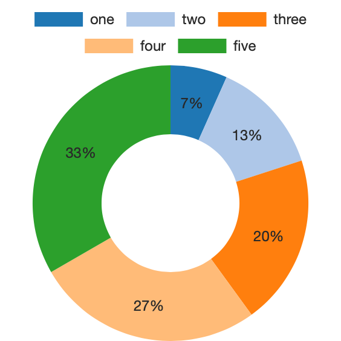

# ChartsJS add-on



## Data Structure: 

For a pie chart, datasets need to contain an array of data points. The data points should be a number, Chart.js will total all of the numbers and calculate the relative proportion of each.

You also need to specify an array of labels so that tooltips appear correctly.

• Enter data manually:
```
	Click "Settings" icon.
	Click "Get Started" button.
	Click "Data" tab.
	Enter data into Data and Label fields.
```

• Import data using script to set "BZ_CHARTJS_PIE::data" and "BZ_CHARTJS_PIE::labels" fields:
```
	Set Variable : [ $_data ; Value: "[1,2,3,4,5]" ]
	Set Variable : [ $_labels ; Value: ""[\"one\",\"two\",\"three\",\"four\",\"five\"]"" ]
	Set Field [ BZ_CHARTJS_PIE::data ; $_data ]
	Set Field [ BZ_CHARTJS_PIE::labels ; $_labels ]
	Commit Records/Requests [ With dialog: Off ]
```

• Import data using Execute FileMaker Data API script step:
```
	Table where your data lives MUST have fields called "DATA" and "LABELS".
	Create separate layout for data api calls. Place "DATA" and "LABEL" field on visible part of layout.
	Go to "Scripts -> Script Workspace -> BZ_CHARTJS_PIE -> getData".
	Edit variable $_query to point to you data table.
	Edit variable $_req. Point "layouts" key to you data api layout.
```

• Import data using data from related fields:
```
	Create a needed relationship.
	Open File -> Manage -> Database.
	Select "BZ_CHARTJS_PIE" table. Click on "CHART_OBJECT" field. Select Options.
	Edit line "	~json = If ( IsEmpty ( data )  ; ~json ; JSONSetElement ( ~json ; "data.datasets[0].data"  ; data ; 4 ));".
	Replace it with "~json = If ( IsEmpty ( YourRelatedFieldName ) ; ~json ; JSONSetElement ( ~json ; "data.datasets[0].data"  ; charts.ListToArray ( YourRelatedFieldName ) ; 4 ));"
	Edit line "	~json = If ( IsEmpty ( labels )  ; ~json ; JSONSetElement ( ~json ; "data.labels"  ; labels ; 4 ));".
	Replace it with line "	~json = If ( IsEmpty ( DATA::LABEL ) ; ~json ; JSONSetElement ( ~json ; "data.labels"  ; charts.ListToArray ( DATA::LABEL ) ; 4 ));
	Click Ok -> Ok -> Ok.
	Remove Data from "data" and "labels" fields from Setting -> Get Started -> Data.
```

